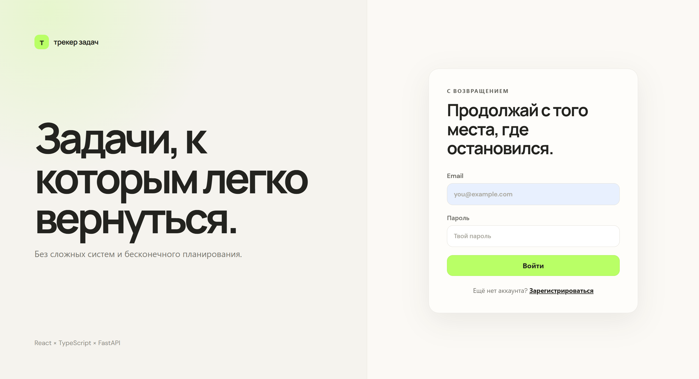
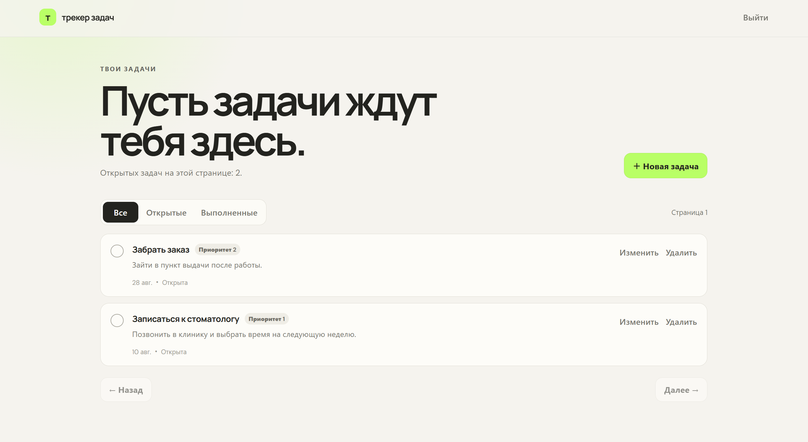
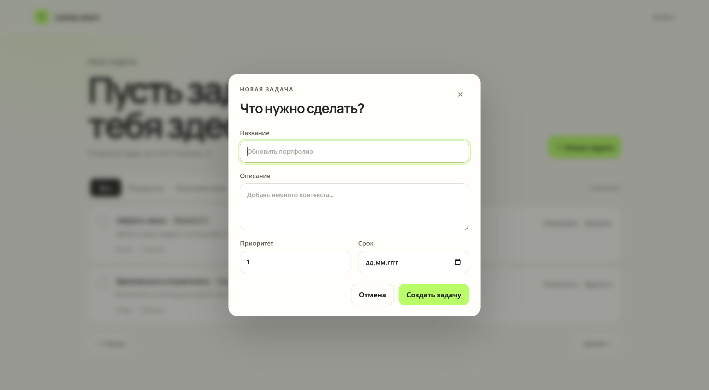
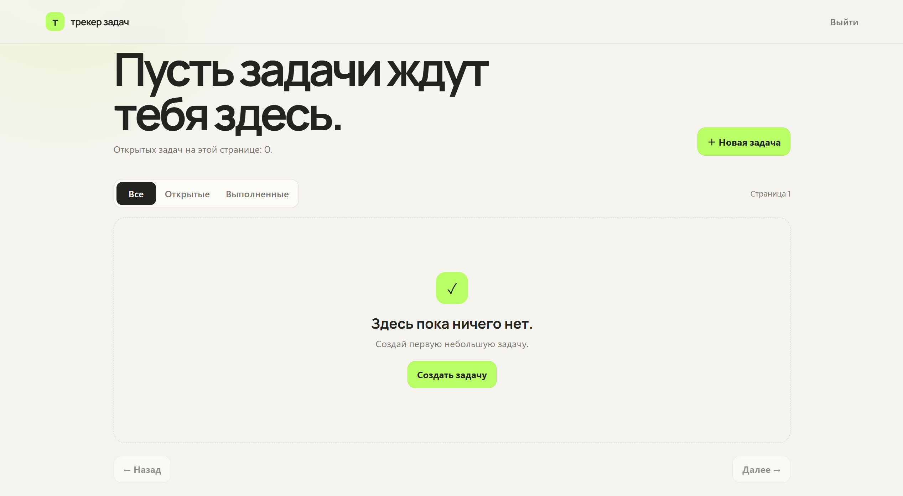

# Task Tracker

Full-stack приложение для управления персональными задачами с JWT-аутентификацией.

Backend реализован на **FastAPI**, **SQLAlchemy 2.0 Async ORM** и **PostgreSQL**, frontend — на **React + TypeScript**.

Для миграций используется **Alembic**, для локального запуска — **Docker Compose**.

## Возможности

- регистрация и авторизация пользователей;
- JWT Bearer authentication;
- CRUD для задач текущего пользователя;
- фильтрация задач по статусу: `open` / `done`;
- пагинация через `limit` и `offset`;
- асинхронная работа с базой данных;
- пользовательский интерфейс на React;
- автоматические проверки через GitHub Actions.

## Стек

### Backend

- Python 3.12
- FastAPI
- SQLAlchemy 2.0 Async ORM
- PostgreSQL
- asyncpg
- Alembic
- Pydantic v2
- pytest

### Frontend

- React
- TypeScript
- Vite
- React Router

### Infrastructure

- Docker / Docker Compose
- Ruff
- GitHub Actions

## Frontend

Для проекта реализован пользовательский интерфейс на **React + TypeScript**.

Frontend поддерживает:

- регистрацию и авторизацию;
- просмотр и фильтрацию задач;
- создание, редактирование и удаление задач;
- изменение статуса задачи;
- пагинацию.

Клиентская часть находится в директории [`frontend`](./frontend).

Подробности по запуску frontend — в [`frontend/README.md`](./frontend/README.md).

## Интерфейс

**Авторизация**



**Список задач**



**Создание новой задачи**



**Пустой список**



## API Endpoints

### Auth

| Method | Endpoint         | Description              |
| ------ | ---------------- | ------------------------ |
| `POST` | `/auth/register` | Регистрация пользователя |
| `POST` | `/auth/login`    | Авторизация пользователя |

### Service

| Method | Endpoint  | Description                  |
| ------ | --------- | ---------------------------- |
| `GET`  | `/health` | Проверка, что сервис запущен |

### Tasks

Для работы с задачами требуется Bearer token.

| Method   | Endpoint           | Description           |
| -------- | ------------------ | --------------------- |
| `POST`   | `/tasks`           | Создать задачу        |
| `GET`    | `/tasks`           | Получить список задач |
| `GET`    | `/tasks/{task_id}` | Получить задачу по ID |
| `PATCH`  | `/tasks/{task_id}` | Обновить задачу       |
| `DELETE` | `/tasks/{task_id}` | Удалить задачу        |

## Переменные окружения

Создайте файл `.env` в корне проекта:

```env
POSTGRES_USER=postgres
POSTGRES_PASSWORD=postgres
POSTGRES_DB=task_tracker

DATABASE_URL=postgresql+asyncpg://postgres:postgres@db:5432/task_tracker

JWT_SECRET_KEY=replace_with_a_long_random_secret_at_least_32_chars
JWT_ALGORITHM=HS256
JWT_ACCESS_TOKEN_EXPIRE_MINUTES=60
```

## Запуск через Docker

```bash
docker compose up --build
```

После запуска backend будет доступен по адресу:

```text
http://127.0.0.1:8081
```

Swagger UI:

```text
http://127.0.0.1:8081/docs
```

ReDoc:

```text
http://127.0.0.1:8081/redoc
```

Остановить контейнеры:

```bash
docker compose down
```

Остановить контейнеры и удалить данные PostgreSQL:

```bash
docker compose down -v
```

## Пример использования

### Регистрация

```bash
curl -X POST "http://127.0.0.1:8081/auth/register" \
  -H "Content-Type: application/json" \
  -d '{"email":"user@example.com","password":"strongpassword123"}'
```

Пример ответа:

```json
{
  "access_token": "<ACCESS_TOKEN>",
  "token_type": "bearer"
}
```

### Логин

```bash
curl -X POST "http://127.0.0.1:8081/auth/login" \
  -H "Content-Type: application/x-www-form-urlencoded" \
  -d "username=user@example.com&password=strongpassword123"
```

### Создание задачи

```bash
curl -X POST "http://127.0.0.1:8081/tasks" \
  -H "Authorization: Bearer <ACCESS_TOKEN>" \
  -H "Content-Type: application/json" \
  -d '{
    "title": "Learn FastAPI",
    "description": "Create task tracker API",
    "priority": 2,
    "due_date": "2026-05-30"
  }'
```

### Получение задач

```bash
curl -X GET "http://127.0.0.1:8081/tasks?status=open&limit=10&offset=0" \
  -H "Authorization: Bearer <ACCESS_TOKEN>"
```

## Тесты

macOS / Linux:

```bash
DATABASE_URL="sqlite+aiosqlite:///:memory:" JWT_SECRET_KEY="abcdefghijklmnopqrstuvwxyz123456" pytest -q
```

Windows PowerShell:

```powershell
$env:DATABASE_URL="sqlite+aiosqlite:///:memory:"
$env:JWT_SECRET_KEY="abcdefghijklmnopqrstuvwxyz123456"
pytest -q
```

## CI

При каждом Pull Request автоматически запускаются:

- `ruff check`
- `ruff format --check`
- `pytest`
