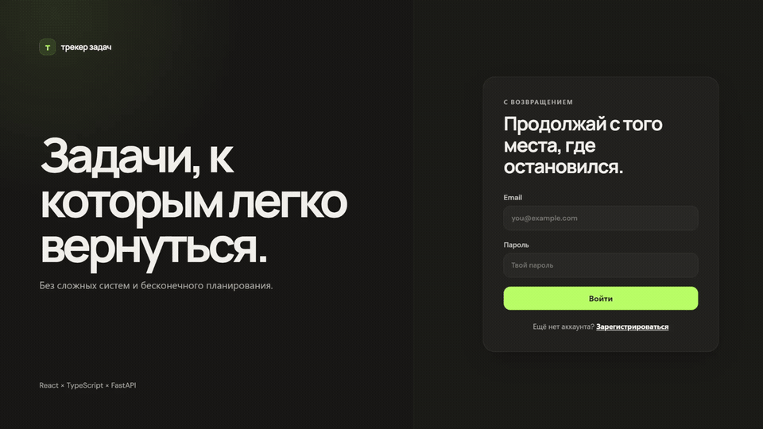

# Task Tracker

Full-stack приложение для управления персональными задачами с JWT-аутентификацией.

Backend реализован на **FastAPI**, **SQLAlchemy 2.0 Async ORM** и **PostgreSQL**, frontend — на **React + TypeScript**.

Для миграций используется **Alembic**, для локального запуска — **Docker Compose**.

## Demo

<p align="center">
  
</p>

## Возможности

### Задачи

- создание, редактирование и удаление задач;
- изменение статуса задачи;
- фильтрация по статусу: все / открытые / выполненные;
- поиск задач;
- пагинация;
- сроки выполнения;
- приоритеты: высокий / средний / низкий;
- статистика по задачам;
- отображение просроченных задач.

### Интерфейс

- адаптивный интерфейс на React;
- светлая и тёмная темы;
- плавное переключение фильтров;
- анимация выполнения задач;
- optimistic UI при изменении статуса;
- отмена удаления задачи через Undo;
- кастомный календарь для выбора срока;
- цветовая индикация приоритетов;
- skeleton-состояние во время загрузки.

### Авторизация

- регистрация пользователей;
- авторизация;
- JWT Bearer authentication;
- защищённые маршруты frontend;
- задачи доступны только авторизованному пользователю.

## Стек

### Backend

- Python 3.12
- FastAPI
- SQLAlchemy 2.0 Async ORM
- PostgreSQL
- asyncpg
- Alembic
- Pydantic v2
- pytest

### Frontend

- React
- TypeScript
- Vite
- React Router
- ESLint

### Infrastructure

- Docker
- Docker Compose
- GitHub Actions
- Ruff

## Frontend

Клиентская часть приложения реализована на **React + TypeScript** и находится в директории [`frontend`](./frontend).

Frontend отвечает за:

- регистрацию и авторизацию;
- отображение задач;
- создание и редактирование задач;
- поиск и фильтрацию;
- изменение статуса;
- удаление с возможностью отмены;
- выбор приоритета;
- выбор срока выполнения;
- статистику;
- переключение темы.

Подробности по запуску frontend — в [`frontend/README.md`](./frontend/README.md).

## Приоритеты

На фронте приоритеты отображаются в виде:

| Значение API | Интерфейс |
| ------------ | --------- |
| `1`          | Высокий   |
| `2`          | Средний   |
| `3`          | Низкий    |

В API приоритет по-прежнему хранится как число.

## API Endpoints

### Auth

| Method | Endpoint         | Description              |
| ------ | ---------------- | ------------------------ |
| `POST` | `/auth/register` | Регистрация пользователя |
| `POST` | `/auth/login`    | Авторизация пользователя |

### Service

| Method | Endpoint  | Description                  |
| ------ | --------- | ---------------------------- |
| `GET`  | `/health` | Проверка, что сервис запущен |

### Tasks

Для работы с задачами требуется Bearer token.

| Method   | Endpoint           | Description           |
| -------- | ------------------ | --------------------- |
| `POST`   | `/tasks`           | Создать задачу        |
| `GET`    | `/tasks`           | Получить список задач |
| `GET`    | `/tasks/{task_id}` | Получить задачу по ID |
| `PATCH`  | `/tasks/{task_id}` | Обновить задачу       |
| `DELETE` | `/tasks/{task_id}` | Удалить задачу        |

## Переменные окружения

Создайте файл `.env` в корне проекта:

```env
POSTGRES_USER=postgres
POSTGRES_PASSWORD=postgres
POSTGRES_DB=task_tracker

DATABASE_URL=postgresql+asyncpg://postgres:postgres@db:5432/task_tracker

JWT_SECRET_KEY=replace_with_a_long_random_secret_at_least_32_chars
JWT_ALGORITHM=HS256
JWT_ACCESS_TOKEN_EXPIRE_MINUTES=60
```

## Запуск через Docker

```bash
docker compose up --build
```

После запуска backend будет доступен по адресу:

```text
http://127.0.0.1:8081
```

Swagger UI:

```text
http://127.0.0.1:8081/docs
```

ReDoc:

```text
http://127.0.0.1:8081/redoc
```

Остановить контейнеры:

```bash
docker compose down
```

Остановить контейнеры и удалить данные PostgreSQL:

```bash
docker compose down -v
```

## Запуск frontend

Перейдите в директорию frontend:

```bash
cd frontend
```

Установите зависимости:

```bash
npm install
```

Запустите dev-сервер:

```bash
npm run dev
```

Production-сборка:

```bash
npm run build
```

Проверка ESLint:

```bash
npm run lint
```

## Пример использования API

### Регистрация

```bash
curl -X POST "http://127.0.0.1:8081/auth/register" \
  -H "Content-Type: application/json" \
  -d '{"email":"user@example.com","password":"strongpassword123"}'
```

Пример ответа:

```json
{
  "access_token": "<ACCESS_TOKEN>",
  "token_type": "bearer"
}
```

### Логин

```bash
curl -X POST "http://127.0.0.1:8081/auth/login" \
  -H "Content-Type: application/x-www-form-urlencoded" \
  -d "username=user@example.com&password=strongpassword123"
```

### Создание задачи

```bash
curl -X POST "http://127.0.0.1:8081/tasks" \
  -H "Authorization: Bearer <ACCESS_TOKEN>" \
  -H "Content-Type: application/json" \
  -d '{
    "title": "Купить продукты",
    "description": "Молоко, яйца, овощи и кофе",
    "priority": 2,
    "due_date": "2026-08-23"
  }'
```

### Получение задач

```bash
curl -X GET "http://127.0.0.1:8081/tasks?status=open&limit=10&offset=0" \
  -H "Authorization: Bearer <ACCESS_TOKEN>"
```

## Тесты

macOS / Linux:

```bash
DATABASE_URL="sqlite+aiosqlite:///:memory:" \
JWT_SECRET_KEY="abcdefghijklmnopqrstuvwxyz123456" \
pytest -q
```

Windows PowerShell:

```powershell
$env:DATABASE_URL="sqlite+aiosqlite:///:memory:"
$env:JWT_SECRET_KEY="abcdefghijklmnopqrstuvwxyz123456"
pytest -q
```

## CI

GitHub Actions автоматически запускается при Pull Request и push в `main`.

### Backend

- `ruff check`
- `ruff format --check`
- `pytest`

### Frontend

- `npm ci`
- `npm run lint`
- `npm run build`

Это позволяет автоматически проверять backend и frontend перед слиянием изменений.